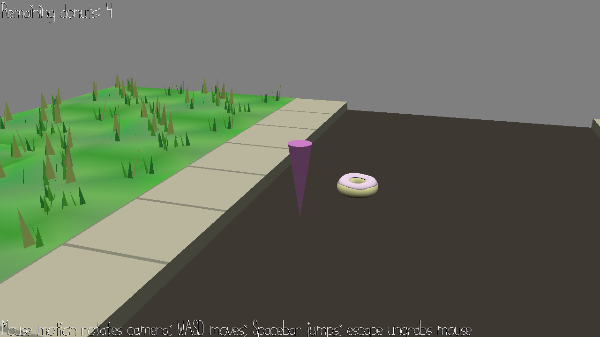

# nom nom nom

Author: Brad Zhang

Design: A 3D object collector game, with jumping and camera controls. Also wrote own "physics engine" to simulate jumping.

Screen Shot:

How To Play:

Control the player with WASD, mouse horizontally for horizontal camera control, spacebar for jump. Run around, explore, and collect the donuts :)

Sources: Built on top of `city.blend` from the 15-466 game2 base code repository (from which this one is forked).

This game was built with [NEST](NEST.md).

